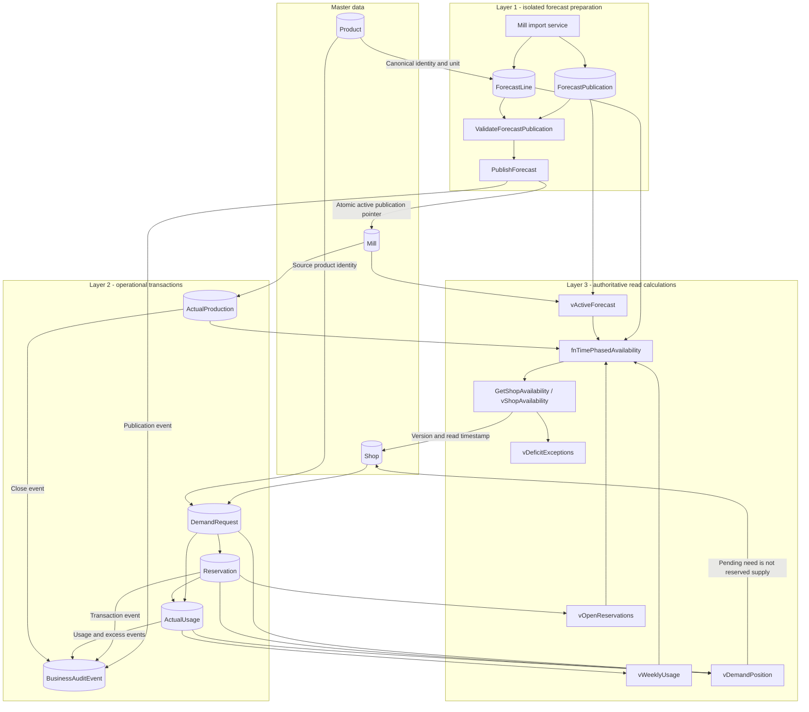
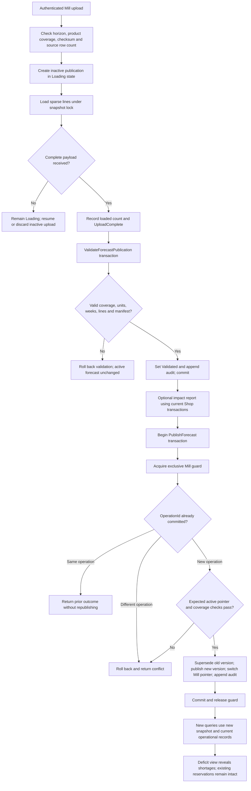
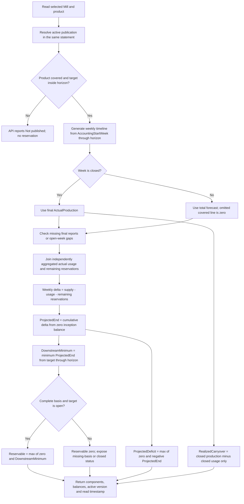
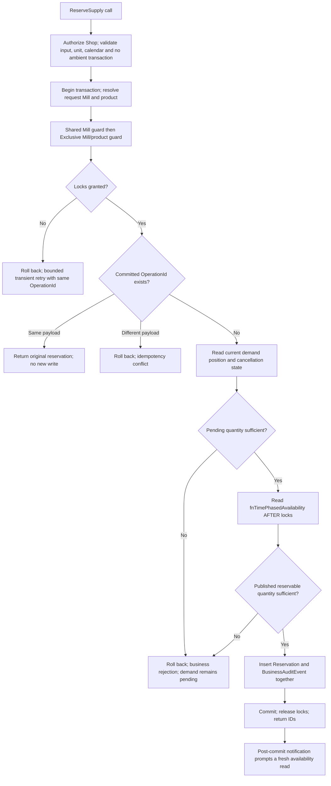
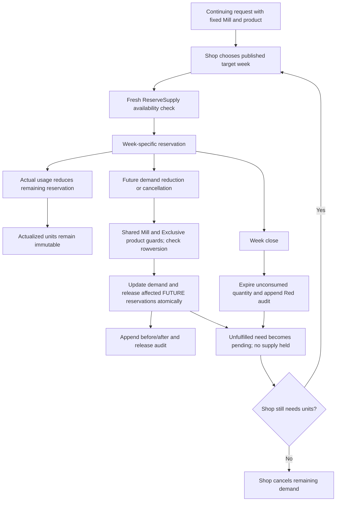
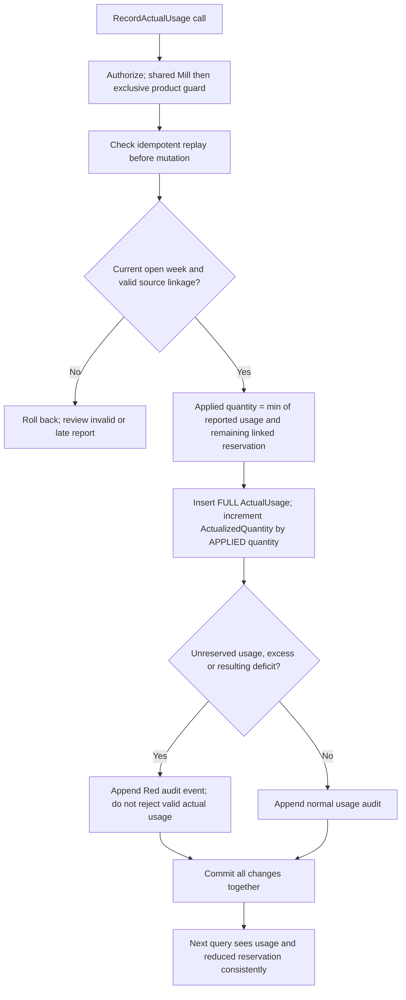
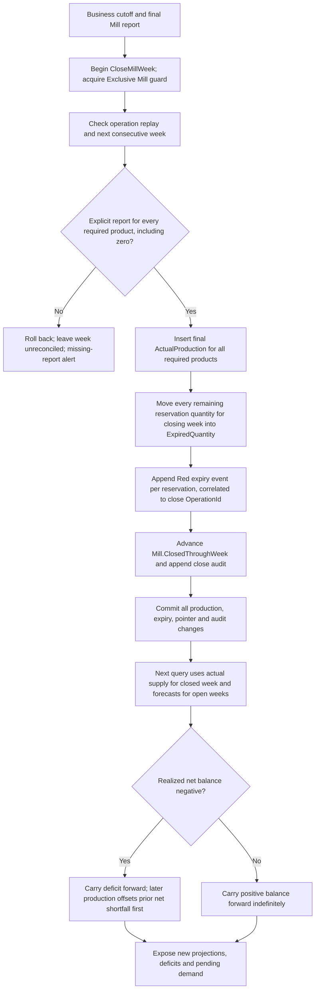
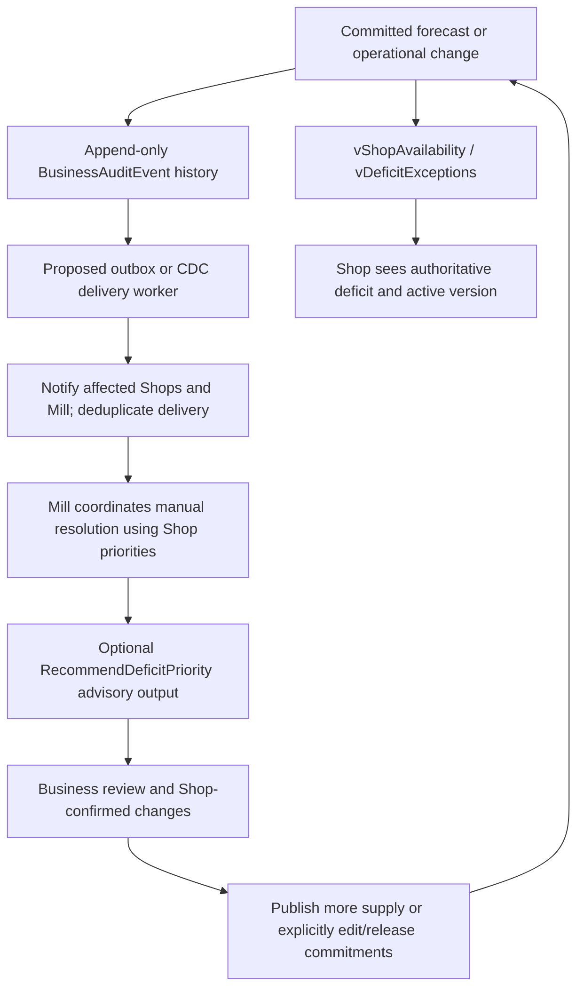

# Technical data and process workflows

These diagrams describe the SQL Server skeleton and the remaining implementation contracts. They are not a claim that all workflows are implemented. Use READ COMMITTED with READ_COMMITTED_SNAPSHOT for writers. A single read statement observes one committed database snapshot. All writes affecting availability must use the same coordination protocol.

## Implementation map

| Workflow | Database entry points | Package status |
| --- | --- | --- |
| Snapshot import | LoadForecastSnapshot | Fail-fast template; import service, permissions and checksum verification required. |
| Snapshot validation and activation | ValidateForecastPublication, PublishForecast | Reference implementations; authorization and full replay payload checks required. |
| Availability | GetShopAvailability, fnTimePhasedAvailability, views | Reference implementations; business calendar and physical inventory limits documented. |
| Reservation | ReserveSupply | Reference implementation; current-week validation, unit rules and authorization required. |
| Demand create/edit/release | CreateDemandRequest, EditFutureDemand, CancelReservation | Fail-fast templates. |
| Actual usage | RecordActualUsage | Fail-fast template. |
| Final production and expiry | CloseMillWeek | Fail-fast template. |
| Priority recommendations | RecommendDeficitPriority | Fail-fast template; advisory only. |
| Durable delivery and case management | Outbox/CDC worker, optional ExceptionCase | Production extensions, not additional objects in the ten-table skeleton. |

## 1. Layered data flow across the ten entities



Arrows indicate dependency or write ownership, not automatic triggers. Audit rows are inserted by the corresponding procedure in the same transaction. Forecast preparation never rebuilds Request, Reservation or ActualUsage. Read calculations are ordinary views/functions: no asynchronous refresh is needed to see committed changes.

## 2. Snapshot loading, validation and activation



Implementation details:

- Loader and validator use `snapshot:<PublicationId>`. They do not acquire the Mill transaction guard during bulk preparation.
- Validation freezes the snapshot; later correction creates another publication. Direct application table writes must be denied so immutable snapshots cannot be edited behind the procedures.
- An impact report is provisional. Reservations may change between validation and activation; the report is not copied into an authoritative balance table.
- PublishForecast takes `forecast:mill:<MillId>` in Exclusive mode, compares ExpectedActivePublicationId, and checks that coverage retains active reservations, historical products and the first unclosed week.
- Negative projected balances caused by lower quantities do NOT prevent publication. Existing reservations remain and the new deficit is displayed.
- Failure in any pointer/status/audit write rolls back the entire activation. No Shop sees a committed pointer referencing a half-activated publication.
- Idempotent replay checks precede pointer comparison so replaying a completed operation does not fail merely because its expected prior pointer is now stale. Production implementation must compare the complete original operation payload.

## 3. Publication versus Shop transaction ordering

```mermaid
sequenceDiagram
    autonumber
    participant Shop as Shop API
    participant Reserve as ReserveSupply
    participant Guard as Transaction-owned locks
    participant Publisher as PublishForecast
    participant DB as SQL Server tables
    participant Reader as Availability reader
    Shop->>Reserve: Request, week, quantity, OperationId
    Reserve->>DB: BEGIN TRANSACTION; resolve immutable source
    Reserve->>Guard: Shared forecast:mill:M
    Guard-->>Reserve: Granted
    Reserve->>Guard: Exclusive balance:M:P
    Guard-->>Reserve: Granted
    Reserve->>DB: Read active V1 and live balances AFTER locks
    Publisher->>Guard: Request Exclusive forecast:mill:M
    Note over Publisher,Guard: Waits for in-flight shared holders; no loading in this window
    Reserve->>DB: Insert reservation referencing V1 and audit
    Reserve->>DB: COMMIT
    Reserve->>Guard: Transaction commit releases both locks
    Guard-->>Publisher: Exclusive Mill guard granted
    Publisher->>DB: Recheck expected V1 and coverage; write V2 pointer, statuses, audit
    Reader->>DB: One RCSI availability SELECT before publisher commit
    DB-->>Reader: V1 plus previously committed reservation
    Publisher->>DB: COMMIT
    Publisher->>Guard: Release Mill guard
    Reader->>DB: Next availability SELECT
    DB-->>Reader: V2 plus preserved reservation; possible deficit
    Shop->>Reserve: Next reservation request
    Reserve->>Guard: Shared Mill then Exclusive product guard
    Reserve->>DB: Recheck availability using V2
```

This is one valid ordering. If publication wins the guard first, reservation waits briefly and then evaluates V2. A competing reservation for the same Mill/product waits for the exclusive product guard and reads the first reservation's committed result afterward. Different products may reserve concurrently under shared Mill guards. Different Mills use separate guards.

Do not use a stale SNAPSHOT transaction for writes. RCSI at READ COMMITTED permits a fresh post-lock statement snapshot. Publication cannot proceed while a Shop writer holds the shared Mill guard. This is short commit coordination, not a guarantee of literally zero waiting. RCSI readers avoid these writer application locks, but schema changes and system/resource failures are outside this availability guarantee.

## 4. Authoritative balance calculation



For week t: `ProjectedEnd(t) = ProjectedOpening(t) + Supply(t) - Usage(t) - RemainingReservations(t)`. Prefix sums carry positive and negative positions into subsequent weeks. A suffix minimum prevents earlier reservations from consuming carryover already promised later. For example, ending balances `[10, 0]` mean the first week has ZERO new reservable quantity, even though its projected ending position is 10.

Realized carryover is a separate signed CLOSED-week net position, not independent reservable stock and not a physical on-hand measurement. Never add forecast and actual production together. Never insert new usage merely to settle an old deficit: that would count it twice. Missing basis invalidates reservability instead of manufacturing a trustworthy zero supply balance.

The function uses a bounded week generator and inception balance zero. Importing an existing opening position or recording physical receipts requires the extensions described in the developer guide. Decimal aggregates are cast to bounded decimal(28,4) before chained arithmetic to preserve fractional precision.

## 5. Reservation decision and retry paths



Authorization, canonical-unit scale, complete payload replay comparison and business-current-week checks are required hardening, not fully implemented in the reference procedure. Transient retry does not turn an insufficient-availability rejection into an accepted reservation. A UI-read version is advisory; the server reads and validates the active version under coordination locks.

## 6. Demand edits, reservation release and rebooking



An expired reservation is never revived. Rebooking inserts a new row for a later week against the SAME Mill. Changing DesiredWeek does not silently move existing reservations. Increasing demand adds pending need; it does not automatically reserve supply. Release order among multiple future reservations must be caller-selected or business-approved. Do not infer current-week edit permission from future-request edit permission.

## 7. Actual usage transaction



For a reservation with 8 remaining, reporting 5 usage produces 3 remaining and 5 actual usage: total demand deducted from the projection stays 8. Reporting 10 usage instead produces zero remaining and 10 actual usage, deepening the position by 2. Excess is not forced into ActualizedQuantity beyond ReservedQuantity. The template also permits usage without a reservation, associated with its request, subject to authenticated reporting policy.

## 8. Final production and week close transaction



An in-flight Shop transaction completing before close belongs to the closing week. A usage transaction ordered after close cannot change a final week; reject for review rather than silently reassigning it. Readers see coherent pre-close or post-close data, never actual production with only half the reservations expired. CloseMillWeek remains a template. Net accounting offsets the oldest shortfall, but detailed Shop-specific FIFO settlement requires a separate settlement ledger.

## 9. Exception visibility and advisory priority



No priority recommendation mutates reservations automatically. Alert delivery may lag; the live database query must not. Exception acknowledgements/resolution events remain in history after a deficit disappears from the current view. A normalized ExceptionCase or outbox table is an optional production extension beyond the ten entities. Do not use a naive high-water audit identity cursor: identity order is not commit order and can skip late commits.

## Object and implementation references

- [01_entities.sql](01_entities.sql): keys, identities, quantities, pointers and indexes.
- [02_availability.sql](02_availability.sql): view dependencies, prefix/suffix balance windows and presentation.
- [03_transactions.sql](03_transactions.sql): implemented validation, publication and reservation locking paths.
- [04_workflow_templates.sql](04_workflow_templates.sql): fail-fast signatures for the required lifecycle workflows.
- [README.md](README.md): deployment, full procedure contracts, security, operational extensions and release gates.

## Diagram review checks

Every balance write and its audit records commit together. Every writer participates in coordination; direct application DML is denied. Publication switches only a verified immutable version. Availability reads do not depend on alert delivery or cached balances. Expiry releases only outstanding reservation quantity. A supply deficit, pending demand and an expired reservation are separate facts. These diagrams do not replace SQL compilation, authorization tests or two-session concurrency tests.
